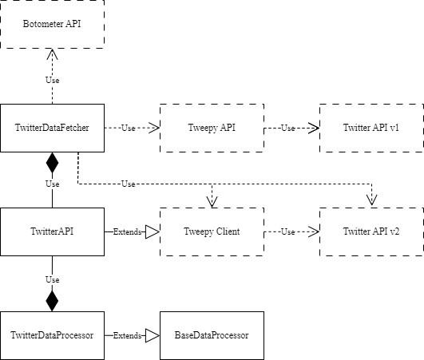

Implementation Details
----------------

This package was designed to perform more detailed and advanced queries to the Twitter API and allows a more detailed analysis of Twitter data.  

Four classes were implemented: ```TwitterAPI```, ```TwitterDataFetcher```, ```BaseDataProcessor```, ```TwitterDataProcessor```

The figure below shows the architecture of the PySNA package:



*PySNA Architecture depicted in UML*


The ```TwitterAPI``` class uses instances of ```TwitterDataFetcher``` and ```TwitterDataProcessor```. This class serves as an interface to the user and is the main class of the package. With this class, all functions of the package (except the ones from the ```utils.py``` module) can be used. It is built on top of the famous [Tweepy](https://github.com/tweepy/tweepy) Python package. Therefore, it inherits the Tweepy Client class and extends it with the functions provided by this package.


During the implementation of this package, the Separation of Concerns design principle was realized. That means, that every class in this package serves a single, well-defined purpose and no interleaving of different procedures exist. Whereas the ``TwitterDataProcessor`` class serves the purpose of processing Twitter-related data and the ``TwitterDataFetcher`` class is used for fetching social data from the Twitter platform using its API, the ``TwitterAPI`` class offers an interface for user interaction. Each class also has a single responsibility.

The design principle of making classes and encapuslation ensures that related data and procedures are kept together within one function and/or class.


An overview of all attributes and methods of the implemented classes is provided in the following UML diagram:


*PySNA Class Overview depicted in UML*

__________________

Available content:

- [TwitterAPI](./TwitterAPI.md)
- [TwitterDataFetcher](./TwitterDataFetcher.md)
- [TwitterDataProcessor](./TwitterDataProcessor.md)
- [BaseDataProcessor](./BaseDataProcessor.md)
- [Utility Functions](./utils.md)
- [CLI Functions](./cli.md)
- [Software Testing](./testing.md)
